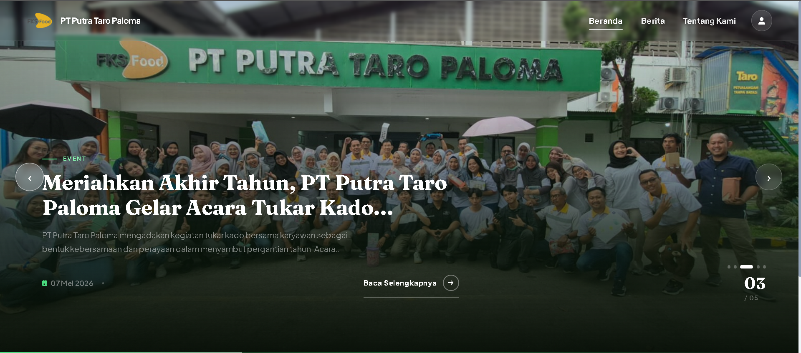
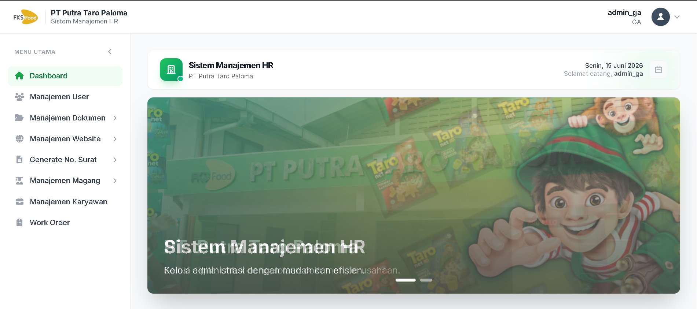
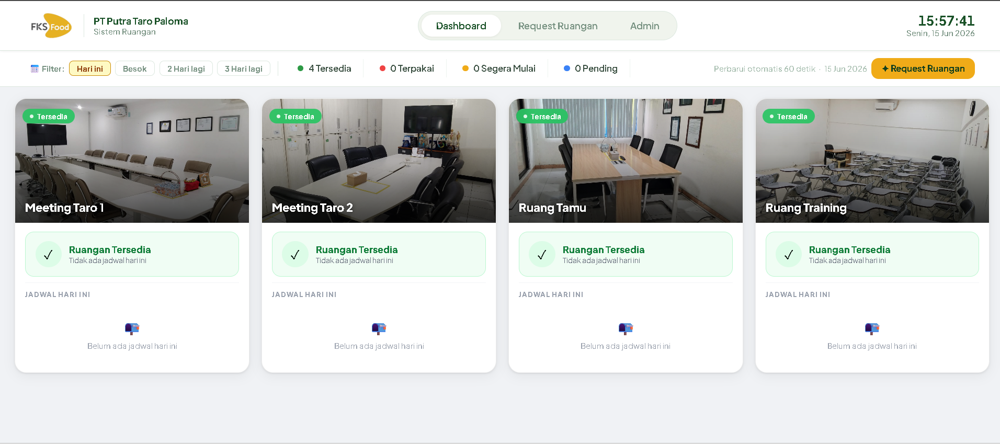

# 👋 Hi, I'm Muhammad Munawar

Seorang **Web Developer** lulusan S1 Informatika dengan pengalaman membangun sistem berbasis web menggunakan **Laravel & MySQL**. Berpengalaman membuat aplikasi enterprise nyata untuk kebutuhan perusahaan manufaktur.

📧 mhmdmunawarr@gmail.com | 🐙 [@waryourbae](https://github.com/waryourbae)

---

## 🗂️ Projects

### 1. 🌐 Landing Page — PT. Putra Taro Paloma

> Website company profile resmi perusahaan

**Fitur:**

- Profil perusahaan
- Halaman berita & update perusahaan
- Halaman kontak

**Teknologi:** Laravel, MySQL, Blade Template, HTML, CSS, JavaScript

🔗 **[Lihat Website](https://putrataropaloma.com)** | 📂 **[Source Code](https://github.com/waryourbae/profil-PT-Putra-Taro-Paloma-)**

---

### 2. 👥 Sistem Human Resource Management — PT. Putra Taro Paloma

> Sistem HR terintegrasi untuk pengelolaan seluruh kebutuhan HR perusahaan secara digital

**Fitur:**

- 📊 Dashboard ringkasan data HR real-time
- 👤 Manajemen user & role akses
- 📁 Manajemen dokumen digital
- 🌐 Manajemen konten website & berita landing page
- 📝 Generate surat otomatis (Internal, Eksternal, Keterangan Kerja)
- 🗄️ Arsip surat digital
- 🎓 Manajemen magang (peserta, generate surat penerimaan & penyelesaian)
- 👨‍💼 Manajemen data karyawan
- 🔧 Work order management

**Teknologi:** Laravel, MySQL, Blade Template, HTML, CSS, JavaScript

🔗 **[Lihat Website](https://hr.putrataropaloma.com)** | 📂 **Source Code: Private** _(available on request)_

---

### 3. 📋 Sistem Audit — PT. Putra Taro Paloma

> Sistem manajemen audit terintegrasi per departemen untuk berbagai jenis audit perusahaan

**Fitur:**

- 📊 Audit 5R — Penilaian kebersihan & kerapian area kerja
- 🦺 Audit HSE — Health, Safety & Environment
- 📋 Audit PRP — Prerequisite Programme
- 🏭 Audit GMP — Good Manufacturing Practice
- 🚶 Gemba 5R — Observasi langsung area 5R
- ⚙️ Gemba Produksi — Observasi lantai produksi
- 🏗️ Gemba Building — Observasi kondisi gedung
- 📈 Laporan terintegrasi per departemen
- 👥 Multi-user per departemen dengan akses berbeda

**Teknologi:** Laravel, MySQL, Blade Template, HTML, CSS, JavaScript

🔗 **[Lihat Website](https://audit.putrataropaloma.com)** | 📂 **Source Code: Private** _(available on request)_

---

### 4. 🏠 Sistem Booking Ruangan — PT. Putra Taro Paloma

> Sistem reservasi ruangan otomatis untuk mencegah bentrok jadwal antar departemen

**Fitur:**

- 📅 Booking ruangan secara online & real-time
- 🚫 Deteksi otomatis bentrok jadwal
- 🏢 Kelola berbagai jenis ruangan:
  - Ruangan Meeting
  - Ruangan Tamu
  - Ruangan Training
- 📊 Jadwal & ketersediaan ruangan
- 🔔 Notifikasi status booking

**Teknologi:** Laravel, MySQL, Blade Template, HTML, CSS, JavaScript

🔗 **[Lihat Website](https://ruangan.putrataropaloma.com)** | 📂 **Source Code: Private** _(available on request)_

---

## 🛠️ Tech Stack

---

## 📊 GitHub Stats

---

> 💼 _Source code project perusahaan bersifat private._
